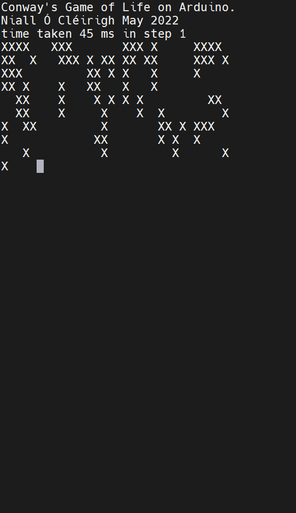

# arduino-nano-conway-gameofile
# Conway's Game of Life running on an Arduino Nano

This is a simple fixed implementation of [Conway's Game of Life](https://en.wikipedia.org/wiki/Conway%27s_Game_of_Life).

It consists of a grid with 1024 cells - (32 x 32).

Each cell is has two possible states: Alive and Dead. 
During each step the following rules are applied:
- Overpopulation: if a living cell is surrounded by more than three living cells, it dies.
- Stasis: if a living cell is surrounded by two or three living cells, it survives.
- Underpopulation: if a living cell is surrounded by fewer than two living cells, it dies.
- Reproduction: if a dead cell is surrounded by exactly three cells, it becomes a live cell.

The board wraps around on the edges and the top/bottom.

To reduce the amount of RAM used by the app (the Nano only has 2K RAM) each cell is stored as a bit in a 1D array.

It takes about 44 milliseconds on an Arduino Nano V3 to perform a single step.

